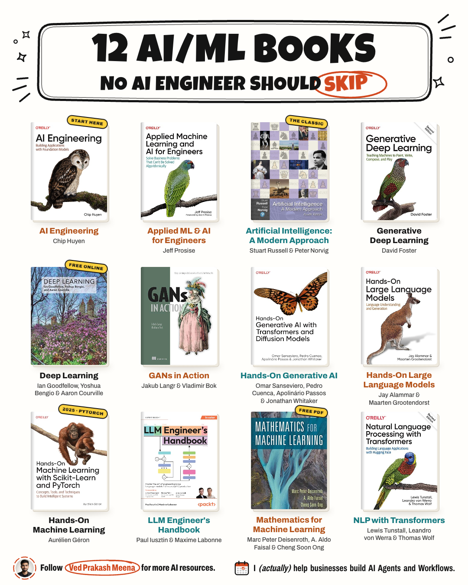

# Opus 5.5 Motion Graphics

Click the image to see it move.

## How to create one

1. Pick one topic and a short list (here: 12 books).
2. Use real images, not AI fakes (covers by ISBN).
3. Give each item one idea to act out.
4. Name every state: cover → flip → animate → flip back.
5. Ask Claude Code for one HTML file with SVG.
6. Open it in Chrome and look at every frame.
7. Tell Claude what looks wrong. Repeat.
8. Fact-check every label and number on screen.
9. Render it to a GIF.

Starter prompt + render command → [motion-graphics/](motion-graphics)

## What each cover does

`1080×1350` · `8-second loop` · `one HTML file` · `no animation library`

Built with Opus 5.5 in Claude Code. Every cover is the real one. Each flips open, animates the idea its book teaches, and flips back.

| # | Book | What moves |
|---|---|---|
| 1 | AI Engineering | App, model and infra blocks stack up |
| 2 | Applied ML and AI for Engineers | Points land, a regression line fits them |
| 3 | AI: A Modern Approach | A knight searches the board |
| 4 | Generative Deep Learning | Noise clears into a landscape |
| 5 | Deep Learning | Signals flow through the layers |
| 6 | GANs in Action | G fakes, D stamps FAKE, G tries again |
| 7 | Hands-On Generative AI | "a cat on the moon" renders in 50 steps |
| 8 | Hands-On LLMs | Tokens → embeddings → attention → next token |
| 9 | Hands-On ML | A decision boundary settles at 100% |
| 10 | LLM Engineer's Handbook | Data → fine-tune → RAG → deploy |
| 11 | Math for ML | A matrix bends the grid |
| 12 | NLP with Transformers | "it" attends to "animal" |

Buy links and official code repos → [books/](books)

---

Made by [Ved Prakash Meena](https://www.linkedin.com/in/ved-prakash-meena/). Follow for more AI resources.
