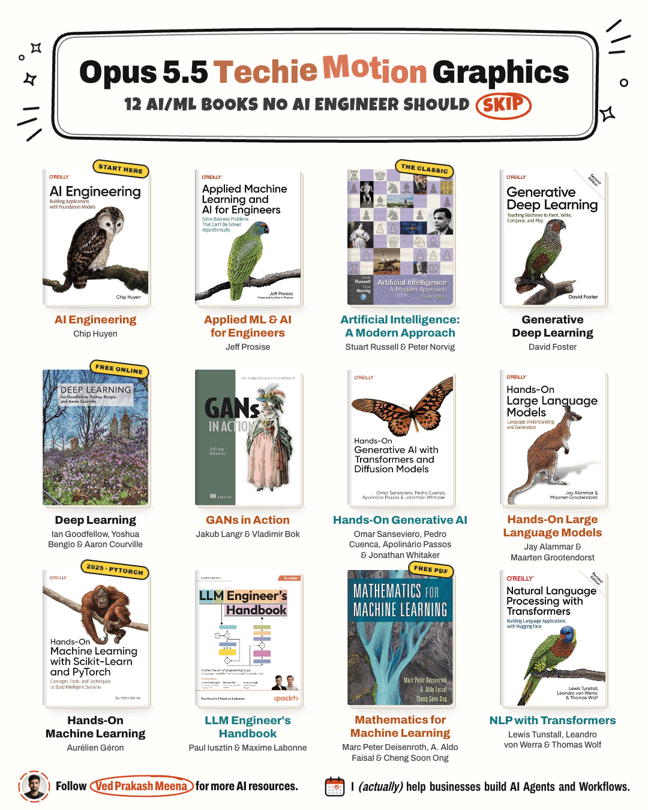

# Motion Graphics with Claude Code



One HTML file. SVG + JavaScript. Rendered to a GIF.

## How to make one

1. Pick one topic and a short list (here: 12 books).
2. Use real images, not AI fakes (covers by ISBN).
3. Give each item one idea to act out.
4. Name every state: cover → flip → animate → flip back.
5. Ask Claude Code for one HTML file with SVG.
6. Open it in Chrome and look at every frame.
7. Tell Claude what looks wrong. Repeat.
8. Fact-check every label and number on screen.
9. Render it to a GIF.

## Starter prompt

```
Build one 1080x1350 HTML file with inline SVG.
Show these 12 book covers in a grid.
Each cover flips to show one animation of its main idea,
then flips back. 8-second seamless loop.
```

## Render the GIF + PNG

```
npm i playwright-core
node render.mjs gif ai-ml-books.html ai-ml-books 1.6
node render.mjs stills ai-ml-books.html stills 1.6
```

Needs Google Chrome + ffmpeg. The Chrome path in `render.mjs` is for macOS.

## Files

- `ai-ml-books.html` → the animation (open it in Chrome)
- `ai-ml-books.png` → still frame
- `render.mjs` → HTML to GIF + MP4, or PNG stills
- `covers/` → the 12 real covers

The books themselves → [../books](../books)
